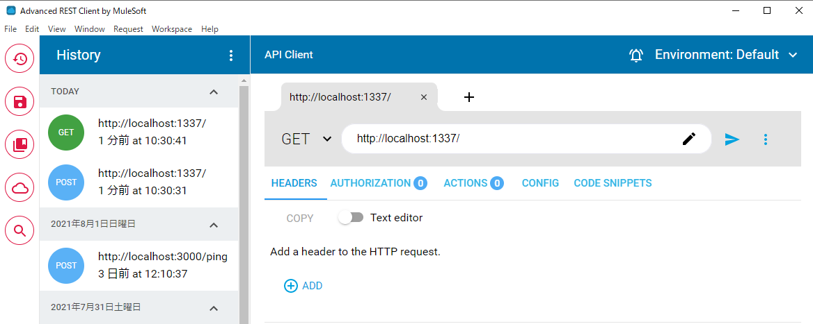
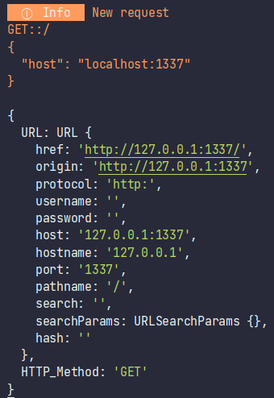

# The simplest example

## Code

Bellow server will return the text "Hello, world!" wrapped to HTML tag `h1` on GET-type request "http://localhost:1337/":

```typescript
import { HTTP_Methods, HTTP_StatusCodes } from "@yamato-daiwa/es-extensions";
import { Server, Request, Response } from "@yamato-daiwa/backend";


Server.initializeAndStart({
  host: "127.0.0.1",
  HTTP: { port: 1337 },
  routing: [
    {
      route: { type: HTTP_Methods.get, pathTemplate: "/" },
      async handler(request: Request, response: Response): Promise<void> {
        console.log(request);
        return response.submit({
          statusCode: HTTP_StatusCodes.OK,
          HTML_Content: "<h1>Hello, world!</h1>"
        });
      }
    }
  ]
});
```


Use `ts-node` or `nodemon` (providing re-running on changes in the code) to run above program.
For the `nodemon` and file name `BackendEntryPoint.ts` the command will be:

```
npx nodemon BackendEntryPoint.ts
```

Now use some REST-client like **Advanced REST client** to test it:



You will receive the HTML code `"<h1>Hello, world!</h1>"` and the server will make logging like:



You can use `HTML_Content` or `JSON_Content` instead of `plainTextContent` to return respective content type.
`@yamato-daiwa/backend` will set up the required headers automatically.
