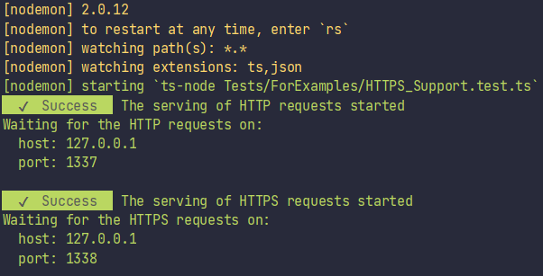

# HTTPS support

## Step 1: Get the SLL key and certificate

To use the HTTPS, you need to obtain the SSL key and SSL certificate first.
For the local development mode, you can use the [OpenSSL](https://www.openssl.org/) utility 
(if your OS is Windows, use [Git Bash](https://gitforwindows.org/) which has build-in OpenSSL).

When the preparations will complete, execute below command and answer to all questions.
You can customize the key file name (`-keyout` parameter) and certificate file name (`-out` parameter).

```
openssl req -newkey rsa:2048 -new -nodes -x509 -days 3650 -keyout key.pem -out cert.pem
```


## Step 2: Code

Create the file which will be the entry point of your application (e. g. `BackendEntryPoint.ts` for the future full-stack
applications) and paste there below code.


```typescript
import { HTTP_Methods, HTTP_StatusCodes } from "@yamato-daiwa/es-extensions";
import { Server, Request, Response } from "@yamato-daiwa/backend";
import Path from "path";


Server.initializeAndStart({
  host: "127.0.0.1",
  HTTP: { port: 1337 },   /* 〔 ✏ 〕 You may skip it if not planing the HTTP support. */
  HTTPS: {
    port: 1338,
    SSL_CertificateFileAbsolutePath: Path.resolve(__dirname, "./SSL/cert.pem"),
    SSL_KeyFileAbsolutePath: Path.resolve(__dirname, "./SSL/key.pem")
  },
  routing: [
    {
      route: { type: HTTP_Methods.get, pathTemplate: "/" },
      async handler(request: Request, response: Response): Promise<void> {
        console.log(request);
        return response.submit({
          statusCode: HTTP_StatusCodes.OK,
          HTML_Content: "<h1>Hello, world!</h1>"
        });
      }
    }
  ]
});
```


## Step 3: Start the server

For the tutorial, compiling of TypeScript in real time with [ts-node](https://github.com/TypeStrong/ts-node) is acceptable.
[Nodemon](https://github.com/remy/nodemon) will use it and also provides the re-compiling and restarting of the application
on changes in code.


Now start your application with `npx nodemon Tests/ForExamples/BackendEntryPoint.ts` (for the file with name `BackendEntryPoint.ts`).
You will see the output like:




## Step 4: Testing

Let's try the HTTPS first. For the above config, the URI will be `https://localhost:1338/`.
Use some REST client (e. g. [Advanced REST client](https://install.advancedrestclient.com/install)) to submit this request.

<!-- Image -->

The server will log it:


If you defined the `HTTP` settings, you can submit the `https://localhost:1338/`.
