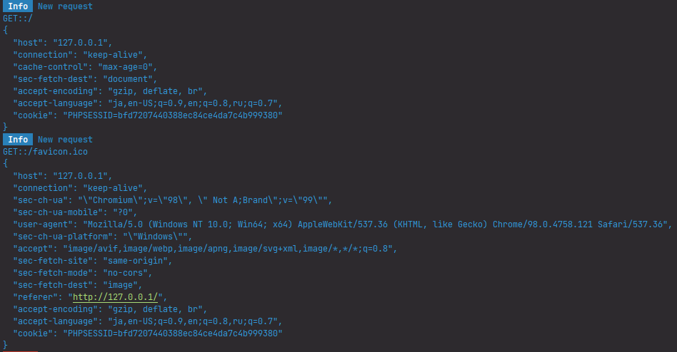

# "Hello, world!" - The simplest example

## Pre-requirements

Install the newest versions of below packages:

* **@yamato-daiwa/backend** - the main packages of this framework. 
* **@yamato-daiwa/es-extensions** - auxiliaries for both BrowserJS and NodeJS. For this tutorial, we will need the 
  **HTTP_Methods** enumeration from this package.
* **ts-node** - the [REPL](https://en.wikipedia.org/wiki/Read%E2%80%93eval%E2%80%93print_loop) for TypeScript 
  implemented by NodeJS. Creating the effect such that TypeScript has own runtime. 
* **nodemon** - in TypeScript case, providing the re-compiling of TypeScript by **ts-node** when source files will chage. 

```
npm i @yamato-daiwa/backend @yamato-daiwa/es-extensions -E
```

```
npm i ts-node nodemon -D -E
```

## Code

Bellow server application will return the text "Hello, world!" wrapped to HTML tag `h1` on GET-type request 
"http://127.0.0.1:80/":

```typescript
import { Server, Request, Response, ProtocolDependentDefaultPorts } from "@yamato-daiwa/backend";
import { HTTP_Methods } from "@yamato-daiwa/es-extensions";


Server.initializeAndStart({
  IP_Address: "127.0.0.1",
  HTTP: { port: ProtocolDependentDefaultPorts.HTTP },
  routing: [
    {
      route: { HTTP_Method: HTTP_Methods.get, pathTemplate: "/" },
      async handler(_request: Request, response: Response): Promise<void> {
        return response.submitWithSuccess({
          HTML_Content: "<h1>Hello, world!</h1>"
        });
      }
    }
  ]
});
```

The **IP_Address** has been made to required property because you as engineer *must* comprehend on which IP-address
your server will run. In real application, it will be environment-dependent (local, staging, production, etc.). We will
discuss the conditional configuration in dedicated tutorials [Dotenv config](../05-DotenvConfig/README.md) and
[Console line interface](../06-ConsoleLineInterface/README.md). Now, if you have no idea which IP-address 
will be appropriate for current tutorial, set **127.0.0.1** (see [localhost article](https://en.wikipedia.org/wiki/Localhost)
for details).

The **80** - the value of **ProtocolDependentDefaultPorts.HTTP** - is default port for HTTP protocol. 
Why you need to specify it explicitly? Again, you *must* comprehend which port your server will serve before it started. 
Next, the specified **HTTP** property tells to framework that you want to serve the HTTP protocol (and HTTP only in this tutorial). 
There is another option - **HTTPS**, which will be discussed in [dedicated tutorial](../02-HTTPS_Support/README.md). 
Currently, the **HTTP** object-type property has only one child property - **port**, but in the future, 
probably more properties will be added.
 
The **routing**, obviously and must be obviously for high quality API, allows defining the routing. 
If you are currently don't understand both **routing** and **URI/URL anatomy**, you need to learn **URI/URL anatomy** first. 
For this lesson, it is important what we are serving the root route only; it means what if we will request, 
for example, **http://127.0.0.1:80/foo** from the browser, not **http://127.0.0.1:80/**, "not found" error will occur.

Use **nodemon** to run your file with above code. If your file in same directory as **package.json**, the command will be:

```
nodemon EntryPoint.ts
```

If you will get the error like "nodemon not found", run

```
npx nodemon EntryPoint.ts
```

instead. You will be informed about successful starting of server:  


Next, open http://127.0.0.1:80/ in browser.
You will see the logging of requests in your terminal:



Most likely, it will be *two* requests (just one could be in the case if you used **http://127.0.0.1:80** recently).
First one we submitted consciously when opened the browser.

Second one has been submitted by browser automatically - browser asked the server for the [favicon](https://en.wikipedia.org/wiki/Favicon).
If the framework has not been prepared for this, it responded with "not found" error, because there is no favicon has been
provided from your side. But the framework provides the default favicon with crane illustrating the web-site or web application
under development. Of course, when publish your web-site/web application, you may want to use your own favicon.
It is simple to do it, but we will consider it [static files](../05-StaticFiles/README.md) tutorial.
