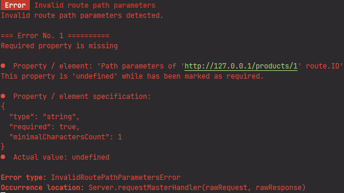
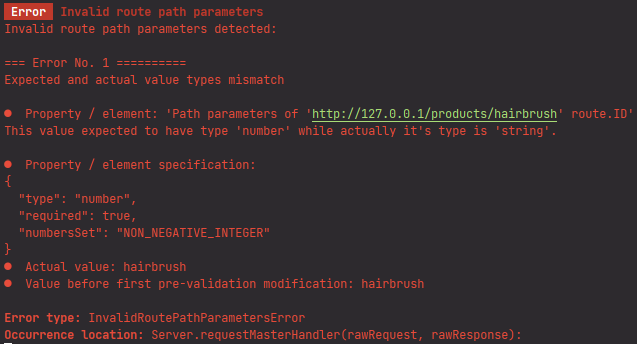
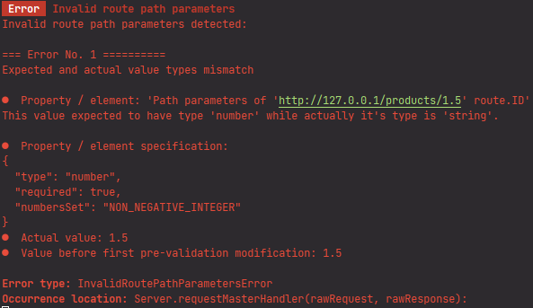

# Route path and query parameters
## Route path

In **generateProductProfilePage** method of **ProductController** from previous lesson, the path parameter **ID** 
has been accessed as `request.routePathParameters.ID`:

```typescript
import { Request, Response, Controller } from "@yamato-daiwa/backend";
import { HTTP_Methods } from "@yamato-daiwa/es-extensions";


export default class ProductController extends Controller {

  @Controller.RouteHandler({
    HTTP_Method: HTTP_Methods.get,
    pathTemplate: "products/:ID"
  })
  public async generateProductProfilePage(request: Request, response: Response): Promise<void> {
    return response.submitWithSuccess({
      HTML_Content: `<h1>Product with ID: ${request.routePathParameters.ID}</h1>`
    });
  }
}
```

The **routePathParameters** property of **request** has type:

```typescript
export type RoutePathParameters = { readonly [pathSegment: string]: string | undefined; };
```

Thus, any path parameter could be **undefined**.
But what if we are sure that **ID** is definitely exists on **request.routePathParameters** for the `products/:ID` route
(if this route is has been successfully resolved) and don't want to be warned by TypeScript about possible undefined value?
Although we can make a typo at `products/:ID` and `request.routePathParameters.ID`, the necessity of additional 
non-undefined check with manual throwing of error routine says about poor functionality of the framework because frameworks
are being designed to take care about routines.

Well, first specify **pathParameterProcessing** at target route to be automatically checked for existence of `ID` parameter:  

```typescript
export default class ProductController extends Controller {

  @Controller.RouteHandler({
    HTTP_Method: HTTP_Methods.get,
    pathTemplate: "products/:ID",
    pathParameterProcessing: {
      ID: {
        type: String,
        required: true,
        minimalCharactersCount: 1
      }
    }
  })
  public async retrieveSingleProduct(request: Request, response: Response): Promise<void> {
    return response.submitWithSuccess({
      HTML_Content: `<h1>Product with ID: ${request.routePathParameters.ID}</h1>`
    });
  }
}
```

For the path parameters processing, 
[RawObjectDataProcessor](https://github.com/TokugawaTakeshi/Yamato-Daiwa-ES-Extensions/blob/master/CoreLibrary/Package/Documentation/RawObjectDataProcessor/RawObjectDataProcessor.md)
of [@yamato-daiwa/es-extensions](https://github.com/TokugawaTakeshi/Yamato-Daiwa-ES-Extensions/blob/master/CoreLibrary/Package/README.md)
library is being used and **pathParameterProcessing** has 
[RawObjectDataProcessor.PropertiesSpecification](https://github.com/TokugawaTakeshi/Yamato-Daiwa-ES-Extensions/blob/master/CoreLibrary/Package/Documentation/RawObjectDataProcessor/RawObjectDataProcessor.md#propertiesspecification-and-related---object-properties-specification)
type. For now, we defined:

* **type** - assume that ID is string
* **required** - because is actually required
* **minimalCharactersCount** - assume that ID has 1 character as minimum.

How, if we make the typo at **pathTemplate** like `products/:Id`, we will know about this typo from the error log:



[//]: # (TODO 再開点)

Once it has done, we can call **getProcessedRoutePathParameters** on **request**, herewith it is required to specify
the expected schema of route parameters via generic parameter:

```typescript
export default class ProductController extends Controller {

  @Controller.RouteHandler({
    HTTP_Method: HTTP_Methods.get,
    pathTemplate: "products/:ID",
    pathParameterProcessing: {
      ID: {
        type: String,
        required: true,
        minimalCharactersCount: 1
      }
    }
  })
  public async retrieveSingleProduct(request: Request, response: Response): Promise<void> {

    const targetProductID: string = request.getProcessedRoutePathParameters<{ ID: string; }>().ID;

    return response.submitWithSuccess({
      HTML_Content: `<h1>Product with ID: ${targetProductID}</h1>`
    });
  }
}
```

> :warning: **Warning:**
> You can invoke **request.getProcessedRoutePathParameters** if and only if **pathParameterProcessing** has been specified,
> otherwise the exception will be thrown.

Works fine, but there is one important TypeScript concept limitation. Because types aliases and interfaces are existing 
only on TypeScript code and has not being compiled to JavaScript, we can not guarantee that some data specification like
**pathParameterProcessing** is actually matching with specific TypeScript type alias or interface. It means that if 
**pathParameterProcessing** and generic parameters of **request.getProcessedRoutePathParameters**, it will be the bug.
Check section
[Problem overview](https://github.com/TokugawaTakeshi/Yamato-Daiwa-ES-Extensions/blob/master/CoreLibrary/Package/Documentation/RawObjectDataProcessor/RawObjectDataProcessor.md#problem-overview)
of **RawObjectDataProcessor** for the details about this limitation. 


### Retrieving of numeric path parameter 

The product ID from the previous example is string as all other route path parameters as default.
But what if we want numeric, more exactly, integer ID?
Usually (in many other frameworks) we need to parse it manually, check for [NaN](https://developer.mozilla.org/en-US/docs/Web/JavaScript/Reference/Global_Objects/NaN),
and return the error. In YDD, all that required is to modify the **pathParameterProcessing**.

First, because initially all path parameters are strings, we need to convert it to number.
The **preValidationModifications** has been designed for it - this is one or more functions accepting the target property
as parameter of `unknown` type and returns also `unknown` type. Although we are expecting the string, actually
it could be anything (in YDB case - `undefined` because of some mistake) so we need convert it only if it is a string.
Furthermore, the fractional IDs are rare, usually it is the integers, so we will use `parseInteger`: 

```typescript
export default class ProductController extends Controller {
  
  @Controller.RouteHandler({
    HTTP_Method: HTTP_Methods.get,
    pathTemplate: "products/:ID",
    pathParameterProcessing: {
      ID: {
        // Don't worry - you don't need to write it each time. We just showed what is going on.
        preValidationModifications: (rawValue: unknown): unknown  => {

          // All of these functions are from `@yamato-daiwa/es-extensions`
          if (!isString(rawValue) || !areStringifiedDigitsOnly(rawValue)) {
            return rawValue;
          }
        
        
          const parsedInteger: number = parseInt(rawValue, 10);
          
          return isNaN(parsedInteger) ? rawValue : parsedInteger;
        },
        type: String,
        required: true,
        minimalCharactersCount: 1
      }
    }
  })
  public async retrieveSingleProduct(request: Request, response: Response): Promise<void> { /* */ }
}
```

Above modifier function is pre-made, and it also being provided by **@yamato-daiwa/es-extensions** as 
**convertUnknownToIntegerIfPossible**. 

Finally, we need to change the validation rules for this already numeric parameter (if it is not numeric, the validation
will fail and errored response will be returned). Usually integer IDs are positive, so, let use specify 
`RawObjectDataProcessor.NumbersSets.nonNegativeInteger` for `numbersSet` option:

```typescript
export default class ProductController extends Controller {

  @Controller.RouteHandler({
    HTTP_Method: HTTP_Methods.get,
    pathTemplate: "products/:ID",
    pathParameterProcessing: {
      ID: {
        preValidationModifications: convertUnknownToIntegerIfPossible,
        type: Number,
        required: true,
        numbersSet: RawObjectDataProcessor.NumbersSets.nonNegativeInteger
      }
    }
  })
  public async retrieveSingleProduct(request: Request, response: Response): Promise<void> {

    const targetProductID: number = request.getProcessedRoutePathParameters<{ ID: number; }>().ID;

    return response.submitWithSuccess({
      HTML_Content: `<h1>Product with ID: ${targetProductID}</h1>`
    });
  }
}
```

#### Testing

Start the application and submit the

```
http://127.0.0.1:80/products/hairbrush
```

Expectedly, the client side will get "Bad Request" error and server will make the log:




Next, let use try to submit the fractional ID:

```
http://127.0.0.1:80/products/1.5
```

We get log:



In **preValidationModifications**, the stringified `1.5` did not pass the **areStringifiedDigitsOnly** check thus
was not converted to integer. If we tried to `parseInt("1.5")`, the result was **1**, so is real application the
entity with ID "1" has been returned what is unacceptable. Same result will be if we try to submit something like

```
http://127.0.0.1:80/products/-2
```

Actually, `numbersSet: RawObjectDataProcessor.NumbersSets.nonNegativeInteger` check has not been performed (in this case),
but the `numbersSet` is required option when `type: Number`.

Finally, 

```
http://127.0.0.1:80/products/5
```

will successfully return HTML `<h1>Product with ID: 5</h1>` to client side.


## Query parameters
### Native URLSearchParams interface

The instance of **request** has the **URI** property which of `Omit<URL, "hash">;` type where **URL**
[is native object](https://developer.mozilla.org/en-US/docs/Web/API/URL). 
It has below properties related with query parameters.

<dl>
  <dt>search</dt>
  <dd>
    For example, in <code>http://127.0.0.1:80/products?paginationPage=2&itemsCountPerPaginationPage=20</code> case,
    it will be <code>?paginationPage=2&itemsCountPerPaginationPage=20</code>
  </dd>
  <dt>searchParams</dt>
  <dd>
    For example, in <code>http://127.0.0.1:80/products?paginationPage=2&itemsCountPerPaginationPage=20</code> case,
    it will be `{ 'paginationPage' => '2', 'itemsCountPerPaginationPage' => '20' }`
  </dd>
</dl>

The **searchParams** property has **URLSearchParams** type:

```typescript
interface URLSearchParams {
  append(name: string, value: string): void;
  delete(name: string): void;
  get(name: string): string | null;
  getAll(name: string): string[];
  has(name: string): boolean;
  set(name: string, value: string): void;
  // ...
}
```

The **get** method has returns only string or null.

* Basically, all data coming from the client is _a priori_ unreliable, so we need to check does desired parameter actually exists,
and if not and it is required - respond with error.
* What if we want the numeric query parameter? Basically we need to parse it, and is parsing failed - response with error.
* What if we want the object-type or arrayed-type parameter? **URLSearchParams** simply not support this.

Off course, YDB allows to deal with these routines.


### Query parameters serializing and deserializing

As the part of URI, _initially_ query parameter is simple string like `?paginationPage=2&itemsCountPerPaginationPage=20`.
This example with two numeric parameters is relatively simple but

* How to express and parse the boolean parameters?
* How to express and parse the object parameters?
* How to express the parse arrayed parameters?
* When try parse numeric parameters and when assume that it is a string?

There is de-facto no standard obligating to express and parse according to specific algorithm, thus working with
query parameter first what we need to negotiate is the **deserializing method**. 

As default, the YDB using the [qs](https://www.npmjs.com/package/qs) with default configuration.

If you want to define the custom serializer for the whole application, in server configuration, define

```typescript
Server.initializeAndStart({
  IP_Address: "127.0.0.1",
  HTTP: { port: ProtocolDependentDefaultPorts.HTTP },
  URI_QueryParametersMainSerializer: (rawQueryParameters: string): ParsedJSON_Object => {
    // It will quite a lot of code, it's better to extract the implementation to separate file
  },
  routing: [
    // ...
  ]
});
```

You can also set the custom serializer for the specific route:

```typescript
import { ArbitraryObject } from "@yamato-daiwa/es-extensions";

export default class ProductController extends Controller {

  @Controller.RouteHandler({
    HTTP_Method: HTTP_Methods.get,
    pathTemplate: "products",
    queryParametersDeserializer(rawQueryParameters: string): ParsedJSON_Object {
      // It will quite a lot of code, it's better to extract the implementation to separate file
    }
  })
  public async retrieveProductsSelection(request: Request, response: Response): Promise<void> {
    // ...
  }
}
```

> :warning: **Warning:** 
> The query parameters serializer which being used on client side must be compatible with deserializer at server side.


### String, numeric and boolean query parameters

Once decide about query parameters serializing/deserializing, time to process them.
For the `retrieveProductsSelection` transaction, let us support below query parameters:

* The pagination page number and items count per pagination page (numeric query parameters) 
* Searching by product name, or it's part (string query parameter)
* Must include the product  (boolean query parameter)

Assume that pagination parameters are required while rest ones - no.


```typescript
export default class ProductController extends Controller {

  @Controller.RouteHandler({
    HTTP_Method: HTTP_Methods.get,
    pathTemplate: "products",
    queryParametersProcessing: {
      paginationPageNumber: {
        preValidationModifications: convertUnknownToIntegerIfPossible,
        type: Number,
        required: true,
        numbersSet: RawObjectDataProcessor.NumbersSets.naturalNumber
      },
      itemsCountPerPaginationPage: {
        preValidationModifications: convertUnknownToIntegerIfPossible,
        type: Number,
        required: true,
        numbersSet: RawObjectDataProcessor.NumbersSets.naturalNumber
      },
      searchingByFullOrPartialProductName: {
        type: String,
        required: false,
        minimalCharactersCount: 2
      },
      mustIncludeProductsOutOfStock: {
        type: Boolean,
        required: false
      }
    }
  })
  public async retrieveProductsSelection(request: Request, response: Response): Promise<void> {

    // Don't worry - will refactor it
    const {
      paginationPageNumber,
      itemsCountPerPaginationPage,
      searchingByFullOrPartialProductName,
      mustIncludeProductsOutOfStock
    }: {
      paginationPageNumber: number,
      itemsCountPerPaginationPage: number,
      searchingByFullOrPartialProductName?: string,
      mustIncludeProductsOutOfStock?: boolean;
    } = request.getProcessedQueryParameters();
    
    return response.submitWithSuccess({
      HTML_Content: "<h1>Products list</h1>"
    });
  }
}
```

The default serializer (**qs**) does not parse numbers and booleans (the reason has been explained by **qs** developers
in [this GitHub issue](https://github.com/ljharb/qs/issues/91)), so for the numeric and boolean parameters we still need
the `preValidationModifications`.

For the numeric parameters, use `convertUnknownToIntegerIfPossible` pre-validation modification.
For the boolean parameters, you need to specify which value you want to consider as `true` and which - as `false`.
Again, there no standard for this. 
For example, if we want to consider stringified "false" and undefined as false, and any other values - as "true",

```typescript
export default class ProductController extends Controller {

  @Controller.RouteHandler({
    HTTP_Method: HTTP_Methods.get,
    pathTemplate: "products",
    queryParametersProcessing: {
      // ...
      mustIncludeProductsOutOfStock: {
        preValidationModifications: (rawValue: unknown): unknown =>
            isNotUndefined(rawValue) && (isString(rawValue) && rawValue === "false"),
        type: Boolean,
        required: false
      }
    }
  })
  public async retrieveProductsSelection(request: Request, response: Response): Promise<void> { /* */ }
}
```

To simplify it, we can consider `undefined` as `false`:

```typescript
export default class ProductController extends Controller {

  @Controller.RouteHandler({
    HTTP_Method: HTTP_Methods.get,
    pathTemplate: "products",
    queryParametersProcessing: {
      // ...
      mustIncludeProductsOutOfStock: {
        preValidationModifications: (rawValue: unknown): boolean => (isString(rawValue) && rawValue !== "false"),
        type: Boolean,
        defaultValue: false
      }
    }
  })
  public async retrieveProductsSelection(request: Request, response: Response): Promise<void> { /* */ }
}
```


[//]: # (### Object- and array-type query parameters )

[//]: # ()
[//]: # ()
[//]: # (## Organizing of code)

[//]: # ()
[//]: # (Significantly, we need to know)

[//]: # ()
[//]: # (* HTTP method)

[//]: # (* URI)

[//]: # (* Path parameters)

[//]: # (* Query parameters)

[//]: # ()
[//]: # (of each request on both client and server side. )

[//]: # ()
[//]: # (// ...)

[//]: # ()
[//]: # (Let's create the file **ProductInteractions**)

[//]: # ()
[//]: # (```typescript)

[//]: # (namespace CategoryInteractions {)

[//]: # ()
[//]: # (  export namespace RetrievingByID {)

[//]: # ()
[//]: # (    export const HTTP_METHOD: HTTP_Methods = HTTP_Methods.get;)

[//]: # ()
[//]: # (    export namespace URI_Path {)

[//]: # ()
[//]: # (      export type Parameters = {)

[//]: # (        readonly categoryID: string;)

[//]: # (      };)

[//]: # ()
[//]: # (      export namespace Parameters {)

[//]: # (        export enum Names {)

[//]: # (          categoryID = "categoryID")

[//]: # (        })

[//]: # (      })

[//]: # ()
[//]: # (      export function build&#40;{ targetCategoryID }: { targetCategoryID: Category.ID; }&#41;: string {)

[//]: # (        return `/api/categories/${targetCategoryID}`;)

[//]: # (      })

[//]: # ()
[//]: # (      export const TEMPLATE: string = build&#40;{ targetCategoryID: `:${Parameters.Names.categoryID}` }&#41;;)

[//]: # (    })

[//]: # (  })

[//]: # (})

[//]: # (```)
