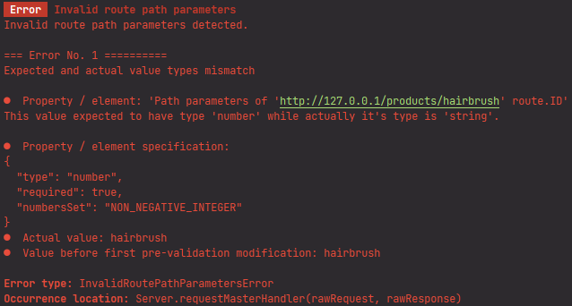
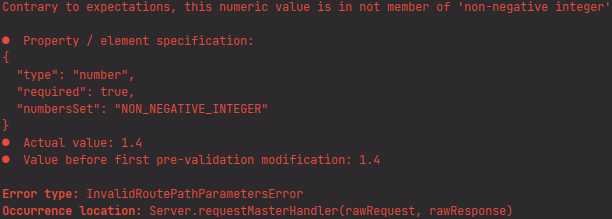

# Route path parameters

In **generateProductProfilePage** method of **ProductController** from previous lesson, the path parameter **ID** 
has been accessed as `request.routePathParameters.ID`:

```typescript
import { Request, Response, Controller } from "@yamato-daiwa/backend";
import { HTTP_Methods } from "@yamato-daiwa/es-extensions";


export default class ProductController extends Controller {

  @Controller.RouteHandler({
    HTTP_Method: HTTP_Methods.get,
    pathTemplate: "products/:ID"
  })
  public async generateProductProfilePage(request: Request, response: Response): Promise<void> {
    return response.submitWithSuccess({
      HTML_Content: `<h1>Product with ID: ${request.routePathParameters.ID}</h1>`
    });
  }
}
```

The **routePathParameters** property of **request** has type:

```typescript
export type RoutePathParameters = { readonly [pathSegment: string]: string | undefined; };
```

Thus, any path parameter could be **undefined**.
But what if we are sure that **ID** is definitely exists on **request.routePathParameters** for the `products/:ID` route
(if this route is has been successfully resolved) and don't want to be warned by TypeScript about possible undefined value?
Although we can make a typo at `products/:ID` and/or `request.routePathParameters.ID`, the necessity of additional 
non-undefined check with manual throwing of error routine says about poor functionality of the framework because frameworks
are being designed to take care about routines.

Well, first specify **pathParameterProcessing** at target route to be automatically checked for existence of `ID` parameter:  

```typescript
export default class ProductController extends Controller {

  @Controller.RouteHandler({
    HTTP_Method: HTTP_Methods.get,
    pathTemplate: "products/:ID",
    pathParameterProcessing: {
      ID: {
        type: String,
        required: true,
        minimalCharactersCount: 1
      }
    }
  })
  public async generateProductProfilePage(request: Request, response: Response): Promise<void> {
    return response.submitWithSuccess({
      HTML_Content: `<h1>Product with ID: ${request.routePathParameters.ID}</h1>`
    });
  }
}
```

For the path parameters processing, 
[RawObjectDataProcessor](https://github.com/TokugawaTakeshi/Yamato-Daiwa-ES-Extensions/blob/master/CoreLibrary/Package/Documentation/RawObjectDataProcessor/RawObjectDataProcessor.md)
of [@yamato-daiwa/es-extensions](https://github.com/TokugawaTakeshi/Yamato-Daiwa-ES-Extensions/blob/master/CoreLibrary/Package/README.md)
library is being used and **pathParameterProcessing** has 
[RawObjectDataProcessor.PropertiesSpecification](https://github.com/TokugawaTakeshi/Yamato-Daiwa-ES-Extensions/blob/master/CoreLibrary/Package/Documentation/RawObjectDataProcessor/RawObjectDataProcessor.md#propertiesspecification-and-related---object-properties-specification)
type. For now, we defined:

* **type** - assume that ID is string
* **required** - because is actually must be
* **minimalCharactersCount** - assume that ID has 1 character as minimum.

Now, if we make the typo at **pathTemplate** like `products/:Id`, we will know about this typo from the error log:


Once it has done, we can call **getProcessedRoutePathParameters** on **request**, herewith it is required to specify
the expected schema of route parameters via generic parameter:

```typescript
export default class ProductController extends Controller {

  @Controller.RouteHandler({
    HTTP_Method: HTTP_Methods.get,
    pathTemplate: "products/:ID",
    pathParametersProcessing: {
      ID: {
        type: String,
        required: true,
        minimalCharactersCount: 1
      }
    }
  })
  public async generateProductProfilePage(request: Request, response: Response): Promise<void> {

    const targetProductID: string = request.getProcessedRoutePathParameters<{ ID: string; }>().ID;

    return response.submitWithSuccess({
      HTML_Content: `<h1>Product with ID: ${targetProductID}</h1>`
    });
  }
}
```

> :warning: **Warning:**
> You can invoke **request.getProcessedRoutePathParameters** if and only if **pathParameterProcessing** has been specified,
> otherwise the exception will be thrown.

Works fine, but there is one important TypeScript concept limitation. Because types aliases and interfaces are existing 
only on TypeScript code and has not being compiled to JavaScript, we can not guarantee that some data specification like
**pathParameterProcessing** is actually matching with specific TypeScript type alias or interface. It means that if 
**pathParameterProcessing** and generic parameter of **request.getProcessedRoutePathParameters** are not matching, 
it will be the bug and TypeScript nothing can do with it.
Check [Problem overview](https://github.com/TokugawaTakeshi/Yamato-Daiwa-ES-Extensions/blob/master/CoreLibrary/Package/Documentation/RawObjectDataProcessor/RawObjectDataProcessor.md#problem-overview)
section of **RawObjectDataProcessor** for the details about this limitation. 


## Retrieving of numeric path parameter

The product ID from the previous example is the string same as all other route path parameters as default.
But what if we want numeric, more exactly, integer ID?
Usually (in many other frameworks) we need to parse it manually, check for [NaN](https://developer.mozilla.org/en-US/docs/Web/JavaScript/Reference/Global_Objects/NaN),
and return the error when parsing is failed. Good framework must take care about it.

First, because initially all path parameters are strings, we need to try to convert it to number.
The **preValidationModifications** has been designed for it - this is one or more functions accepting the target property's value
as parameter of `unknown` type and returns also `unknown` type. Although we are expecting the string, actually
it could be anything (in YDB case - `undefined` because of some mistake) so we need convert it only if it is a string,
otherwise return the value in untouched state.
The **@yamato-daiwa/es-extensions** provides the **convertPotentialStringToNumberIfPossible** helper function for this case:


```typescript
export default class ProductController extends Controller {

  @Controller.RouteHandler({
    HTTP_Method: HTTP_Methods.get,
    pathTemplate: "products/:ID",
    pathParametersProcessing: {
      ID: {
        preValidationModifications: convertPotentialStringToNumberIfPossible,
        type: String,
        required: true,
        minimalCharactersCount: 1
      }
    }
  })
  public async generateProductProfilePage(request: Request, response: Response): Promise<void> {

    const targetProductID: string = request.getProcessedRoutePathParameters<{ ID: string; }>().ID;

    return response.submitWithSuccess({
      HTML_Content: `<h1>Product with ID: ${targetProductID}</h1>`
    });
  }
}
```

Finally, we need to change the validation rules for this already numeric parameter (if it is not numeric, the validation
will fail and errored response will be returned). Usually integer IDs are positive, so, let use specify 
`RawObjectDataProcessor.NumbersSets.nonNegativeInteger` for `numbersSet` option:

```typescript
export default class ProductController extends Controller {

  @Controller.RouteHandler({
    HTTP_Method: HTTP_Methods.get,
    pathTemplate: "products/:ID",
    pathParameterProcessing: {
      ID: {
        preValidationModifications: convertUnknownToIntegerIfPossible,
        type: Number,
        required: true,
        numbersSet: RawObjectDataProcessor.NumbersSets.nonNegativeInteger
      }
    }
  })
  public async generateProductProfilePage(request: Request, response: Response): Promise<void> {

    const targetProductID: number = request.getProcessedRoutePathParameters<{ ID: number; }>().ID;

    return response.submitWithSuccess({
      HTML_Content: `<h1>Product with ID: ${targetProductID}</h1>`
    });
  }
}
```

### Testing

Start the application and submit the

```
http://127.0.0.1:80/products/hairbrush
```

Expectedly, the client side will get "Bad Request" error because the route path parameter is not the parsable integer.
The server will make the log:




Next, let use try to submit the fractional ID:

```
http://127.0.0.1:80/products/1.4
```

The client side will get "Bad Request" error because although the ID has been parsed, it's value is not an integer.
The server will log:



Finally, 

```
http://127.0.0.1:80/products/5
```

will successfully return HTML `<h1>Product with ID: 5</h1>` to client side.
