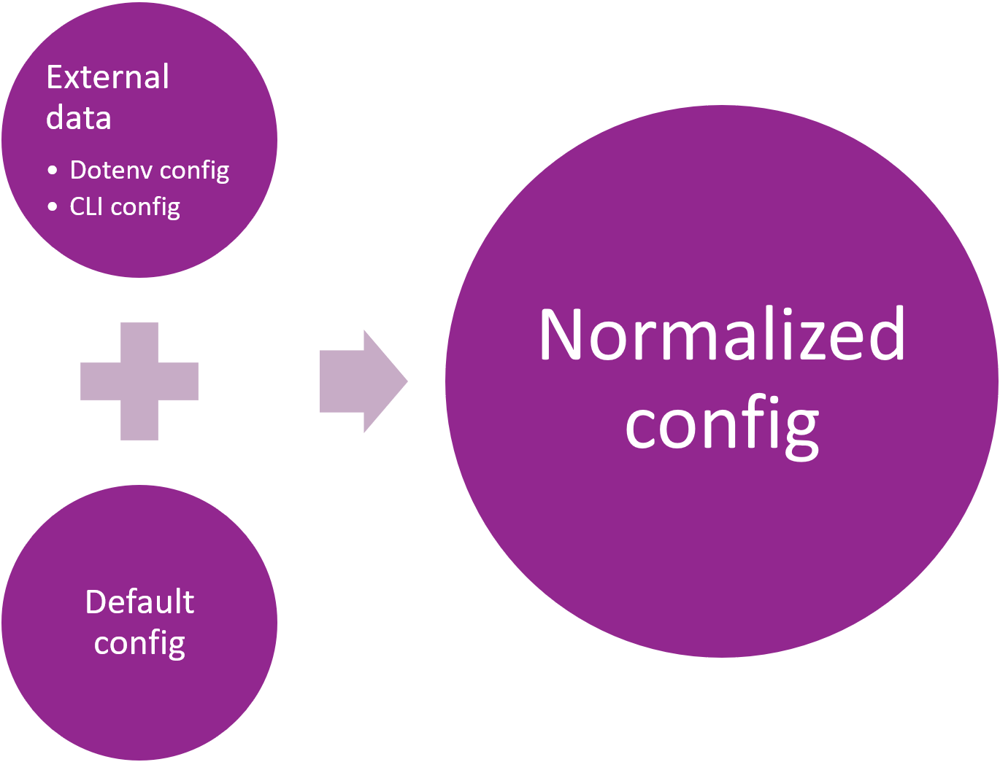

# Console Line Interface configuration

Another way of passing of the configuration is the [Console Line Interface](https://en.wikipedia.org/wiki/Command-line_interface) (CLI).
It is the pretty old method which was available at the start of personal computers age.
Many of programmers still like this operationing method, however it has serious issues because of which CLI is not being
practiced by regular personal computer users (non-engineers):

* Ever memorization or checking of the documentation each time could require
* Mistyping could occur during inputting of the command
* The inputting of long commands cold take some time

As a result, the human factor is pretty big here. 
However, because of popularity of this method, we as the framework developers have to support it.  


## Minimal theory

Let us start the explanations from normal **.js** file - **test.js**.
Add `console.log("ok!");` there to get some feedback and execute `node test.js` from the console.
You will get `ok!` output.

Now, change `console.log("ok!");` to `console.log(process.argv);` and run

```shell
node test.js --foo alpha --bar 1 --baz true
```

You will get output like below herewith first and particularly second parameter element could differ for your computer:

```
[
  'C:\\Program Files\\nodejs\\node.exe',
  'D:\\IntelliJ IDEA\\InHouseDevelopment\\YamatoDaiwaBackend\\Tutorials\\07-ConsoleLineInterface\\test.js',
  '--foo',
  'alpha',
  '--bar',
  '1',
  '--baz',
  'true'
]
```

Currently, we are using **nodemon** in this lesson. The output of `console.log(process.argv);` will be similar for

```shell
nodemon test.js --foo alpha --bar 1 --baz true
```

As you see, the [process.argv](https://nodejs.org/docs/latest/api/process.html#processargv) is the plain array of 
string elements.

> The first element will be [process.execPath](https://nodejs.org/docs/latest/api/process.html#processexecpath). 
> See `process.argv0` if access to the original value of `argv[0]` is needed. 
> The second element will be the path to the JavaScript file being executed.
> The remaining elements will be any additional command-line arguments.
> 
> [Official documentation](https://nodejs.org/docs/latest/api/process.html#processargv)

Thus, we are interested in elements mainly from the third one (from the second if count from 0).
Noticeable, but we are free to decide what to do with them: there is de-facto no standard how to interpret these string
elements - just more or less established convention. Moreover, there is also no unified official terminology!

The Node.js does not suggest the native solutions for the parsing of the **process.argv**.
Ever Node.js official website [urges to use the third-party solutions](https://nodejs.org/en/knowledge/command-line/how-to-parse-command-line-arguments/):

> Referring to your command-line arguments by array index isn't very clean, and can quickly turn into a nightmare when
> you start working with flags and the like - imagine you made a server, and it needed a lot of arguments. 
> Imagine having to deal with something like myapp -h host -p port -r -v -b --quiet -x -o outfile - some flags need to 
> know about what comes next, some don't, and most CLIs let users specify arguments in any order they want. 
> Sound like a fun string to parse?
> 
> Luckily, there are many third party modules that makes all of this trivial - one of which is [yargs](https://www.npmjs.com/package/yargs).
> 
> [How to parse command line arguments - Node.js official website](https://nodejs.org/en/knowledge/command-line/how-to-parse-command-line-arguments/)

From our side, we are suggesting the [ConsoleCommandParser](https://github.com/TokugawaTakeshi/Yamato-Daiwa-ES-Extensions/blob/master/NodeJS/Package/Documentation/ConsoleCommandsParser/ConsoleCommandsParser.md).
Because except the server applications, the parsing of the command-line arguments is about console utilities too, this
functionality is a part of [**@yamato-daiwa/es-extensions-nodejs** auxiliary package](https://github.com/TokugawaTakeshi/Yamato-Daiwa-ES-Extensions/blob/master/NodeJS/Package/README.md).

Please check the documentation of [ConsoleCommandParser](https://github.com/TokugawaTakeshi/Yamato-Daiwa-ES-Extensions/blob/master/NodeJS/Package/Documentation/ConsoleCommandsParser/ConsoleCommandsParser.md) first 
because as it was mentioned above, there is de facto no unified official terminology and standards how to input and parse the arguments, but
the documentation for **ConsoleCommandParser** is introducing this convention. 
Once done, proceed to **Practice** section.


## Practice

This time, we will modify the code of the previous lesson because we will keep **Dotenv** config.

### Defining the CLI

Let us create the **ConsoleLineInterface.ts** file and define the parameter of single (in the case of our application)
command.

```typescript
import { ConsoleCommandsParser } from "@yamato-daiwa/es-extensions-nodejs";
import { RawObjectDataProcessor } from "@yamato-daiwa/es-extensions";


namespace ConfigFromConsoleCommand {

  export const specification: ConsoleCommandsParser.CommandLineInterfaceSpecification = {
    applicationName: "Server",
    defaultCommand: {
      IP_Address: {
        type: ConsoleCommandsParser.ParametersTypes.string,
        required: false
      },
      HTTP_Port: {
        type: ConsoleCommandsParser.ParametersTypes.number,
        numbersSet: RawObjectDataProcessor.NumbersSets.nonNegativeInteger,
        required: false
      }
    }
  };

  export type ParsedArguments = Readonly<{
    IP_Address?: string;
    HTTP_Port?: number;
  }>;
}


export default ConfigFromConsoleCommand;
```

The **ConsoleCommandsParser** will try to parse number if the type of argument specified as **ConsoleCommandsParser.ParametersTypes.number**.
If all argument will be successfully parsed, we'll get the object of **ConsoleLineInterface.ParedCommand** type.

Next, in the entry point, we'll try to retrieve the configuration from the console command:

```typescript
import ConsoleLineInterface from "./ConsoleLineInterface";

const parsedConsoleCommand: ConsoleCommandsParser.ParsedCommand<ConsoleLineInterface.ParedCommand> =
    ConsoleCommandsParser.parse(process.argv, ConsoleLineInterface.specification);
```

The **ConsoleCommandsParser.parse** method accepts 2 parameters - the array **process.argv** and the specification of
expected arguments (has been prepared above). 
It returns the object of **ConsoleCommandsParser.ParsedCommand<GeneralizedCommandsAndOptionsCombinations>** type.
When there are no command phrases (such as our case), the **GeneralizedCommandsAndOptionsCombinations** will be just the
object of expected arguments extracted from the console command - **ConsoleLineInterface.ParedCommand**.

Similarly to Dotenv config case, some errors could be thrown during the processing of the parameters.
It is O'K to not catch these errors <ins>while server has not started</ins>.

Well, that is all for the minimal introduction to CLI usage, but we need to organize our previous code.


### Organizing of the Dotenv configuration

Similarly to **ConfigFromConsoleCommand.ts** file, let us prepare the **ConfigFromDotEnvFile.ts** file with below content:

```typescript
import { convertPotentialStringToNumberIfPossible, RawObjectDataProcessor } from "@yamato-daiwa/es-extensions";


type ConfigFromDotEnvFile = Readonly<{
  IP_ADDRESS?: string;
  HTTP_PORT?: number;
}>;


namespace ConfigFromDotEnvFile {

  export const specification: RawObjectDataProcessor.ObjectDataSpecification = {
    nameForLogging: "ConfigurationFromDotenv",
    subtype: RawObjectDataProcessor.ObjectSubtypes.fixedKeyAndValuePairsObject,
    properties: {
      IP_ADDRESS: {
        type: String,
        required: false
      },
      HTTP_PORT: {
        preValidationModifications: convertPotentialStringToNumberIfPossible,
        type: Number,
        numbersSet: RawObjectDataProcessor.NumbersSets.nonNegativeInteger,
        required: false
      }
    }
  };
}


export default ConfigFromDotEnvFile;
```

Now, the initialization of **configFromDotenvFile** variable could be simplified as: 

```typescript
const configFromDotenvFile: ConfigFromDotEnvFile = ObjectDataFilesProcessor.processFile({
  filePath: ".env",
  schema: ObjectDataFilesProcessor.SupportedSchemas.DOTENV,
  validDataSpecification: ConfigFromDotEnvFile.specification
});
```


### Default configuration

Let prepare the default configuration in **DefaultConfig.ts** file:

```typescript
import { ProtocolDependentDefaultPorts } from "@yamato-daiwa/backend";

type DefaultConfig = Readonly<{
  IP_Address: string;
  HTTP_Port: number;
}>;


const DefaultConfig: DefaultConfig = {
  IP_Address: "127.0.0.1",
  HTTP_Port: ProtocolDependentDefaultPorts.HTTP
};


export default DefaultConfig;
```


### Normalizing of configuration

Both **HTTP_Port** and **IP_Address** are optional at both **Dotenv** configuration and **CLI**,
but we need these settings to run the application. It is the case where the schema convenient for the developer and 
the schema convenient for the maintainer who will be start the application are different.
The **normalizing of the config** is the transformation of the configuration from the schema convenient for the maintainer or
user to the convenient for the developer.

We already declared the normalized config (type **Config**), but now we need to rename it to
**NormalizedConfig** for the accuracy:

```typescript
type NormalizedConfig = Readonly<{
  IP_Address: string;
  HTTP_Port: number;
}>;


export default NormalizedConfig;
```

Next, we need to normalize it. In our case, we will merge the configuration from the Dotenv with configuration from the CLI
with right priority and if something is missing - substitute the default value:



The class which doing this merging could be named as **ConfigNormalizer** - by the design pattern name.
Currently, the implementation is very simple:

```typescript
export default abstract class ConfigNormalizer {

  public static normalize(
    {
      configFromConsoleCommand,
      configFromDotenvFile
    }: Readonly<{
      configFromConsoleCommand: ConfigFromConsoleCommand.ParsedArguments;
      configFromDotenvFile: ConfigFromDotEnvFile;
    }>
  ): NormalizedConfig {

    return {
      IP_Address: configFromConsoleCommand.IP_Address ?? configFromDotenvFile.IP_ADDRESS ?? DefaultConfig.IP_Address,
      HTTP_Port: configFromConsoleCommand.HTTP_Port ?? configFromDotenvFile.HTTP_PORT ?? DefaultConfig.HTTP_Port
    };
  }
}
```

But as far as the settings will become more and complicated, the computing of each property will become complicated too; 
to organize the code additional private static methods could require.

Finally, we need to modify the **ConfigRepresentative**.
It does not the config normalizing anymore because it is not it's role.

```typescript
import NormalizedConfig from "./NormalizedConfig";
import { Logger, ClassRequiredInitializationHasNotBeenExecutedError, isNull } from "@yamato-daiwa/es-extensions";


export default class ConfigRepresentative {

  private static normalizedConfig: NormalizedConfig | null = null;


  public static initialize(normalizedConfig: NormalizedConfig): void {
    ConfigRepresentative.normalizedConfig = normalizedConfig;
  }


  public static get IP_Address(): string {
    return ConfigRepresentative.getConfigWhichExpectedToBeInitialized().IP_Address;
  }

  public static get HTTP_Port(): number {
    return ConfigRepresentative.getConfigWhichExpectedToBeInitialized().HTTP_Port;
  }


  private static getConfigWhichExpectedToBeInitialized(): NormalizedConfig {

    if (isNull(ConfigRepresentative.normalizedConfig)) {
      Logger.throwErrorAndLog({
        errorInstance: new ClassRequiredInitializationHasNotBeenExecutedError({
          className: "ConfigRepresentative",
          initializingMethodName: "initialize"
        }),
        title: ClassRequiredInitializationHasNotBeenExecutedError.localization.defaultTitle,
        occurrenceLocation: "ConfigRepresentative.getConfigWhichExpectedToBeInitialized()"
      });
    }


    return ConfigRepresentative.normalizedConfig;
  }
}
```

It still seems redundant, but it is only because currently the quantity of settings is small (just two).
In the future, it will not just return normalized config but also do some computings.

The best example which could be given for the above 2 settings is the computing of HTTP origin:

```typescript
export default class ConfigRepresentative {

  private static normalizedConfig: NormalizedConfig | null = null;

  // ...

  public static get IP_Address(): string {
    return ConfigRepresentative.getConfigWhichExpectedToBeInitialized().IP_Address;
  }

  public static get HTTP_Port(): number {
    return ConfigRepresentative.getConfigWhichExpectedToBeInitialized().HTTP_Port;
  }

  public static get HTTP_Origin(): string {
    return `http://${ConfigRepresentative.IP_Address}:${ConfigRepresentative.HTTP_Port}`;
  }


  // ...
}
```

However, `get` computes each time when accessed while HTTP origin will not change during application is running. 
In this case, it's better to add the HTTP origin to **NormalizedConfig** and compute it once during the normalizing of the config.
So, since getters could not accept the parameters (without hacks with returning of function), the computing methods
of the **ConfigRepresentative** should compute something based on **NormalizedConfig** and some data which could be 
available only after server will start.

Well, let us use the **ConfigNormalizer** in the entry point. As result, the refactored entry point will be:

```typescript
/* --- Configuration ------------------------------------------------------------------------------------------------ */
import ConsoleLineInterface from "./ConfigFromConsoleCommand";
import ConfigFromDotEnvFile from "./ConfigFromDotEnvFile";
import NormalizedConfig from "./NormalizedConfig";
import ConfigNormalizer from "./ConfigNormalizer";
import ConfigRepresentative from "./ConfigRepresentative";

/* --- Framework ---------------------------------------------------------------------------------------------------- */
import { Server, Request, Response } from "@yamato-daiwa/backend";

/* --- Utils -------------------------------------------------------------------------------------------------------- */
import { HTTP_Methods } from "@yamato-daiwa/es-extensions";
import { ConsoleCommandsParser, ObjectDataFilesProcessor } from "@yamato-daiwa/es-extensions-nodejs";


const configFromConsoleCommand: ConsoleCommandsParser.ParsedCommand<ConsoleLineInterface.ParsedArguments> =
    ConsoleCommandsParser.parse(process.argv, ConsoleLineInterface.specification);

const configFromDotenvFile: ConfigFromDotEnvFile = ObjectDataFilesProcessor.processFile({
  filePath: ".env",
  schema: ObjectDataFilesProcessor.SupportedSchemas.DOTENV,
  validDataSpecification: ConfigFromDotEnvFile.specification
});

const normalizedConfig: NormalizedConfig = ConfigNormalizer.normalize({
  configFromConsoleCommand, configFromDotenvFile
});

ConfigRepresentative.initialize(normalizedConfig);


Server.initializeAndStart({
  IP_Address: ConfigRepresentative.IP_Address,
  HTTP: { port: ConfigRepresentative.HTTP_Port },
  routing: [
    {
      route: { HTTP_Method: HTTP_Methods.get, pathTemplate: "/" },
      async handler(_request: Request, response: Response): Promise<void> {
        return response.submitWithSuccess({
          HTML_Content: "<h1>Top page</h1>"
        });
      }
    }
  ]
});
```

### Testing

Let **80** will be the default HTTP port, **81** - in **.env** config.
First try to run:  

```shell
nodemon EntryPoint.ts --HTTP_Port 82
```

We'll get the output:

```
Waiting for the HTTP requests on:
  IP address: 127.0.0.1
  Port: 82
  Starting URI: http://127.0.0.1:82
```

Now, run just:

```shell
nodemon EntryPoint.ts
```

We'll get the output:

```
Waiting for the HTTP requests on:
  IP address: 127.0.0.1
  Port: 81
  Starting URI: http://127.0.0.1:81
```

Finally, if we'll remove the **HTTP_PORT** from **.env**, we'll get:

```
Waiting for the HTTP requests on:
  IP address: 127.0.0.1
  Port: 80
  Starting URI: http://127.0.0.1:80
```

Works as expected. Do the similar test for the IT address.


[//]: # (### Environment dependent .env file)

[//]: # ()
[//]: # (Currently, we have single **.env** file for all environments what is too far from the real application.)

[//]: # (But how our application will know which Dotenv file should to use?)

[//]: # (We can pass the path to Dotenv file via argument of the console command.  )

[//]: # ()
[//]: # ()
